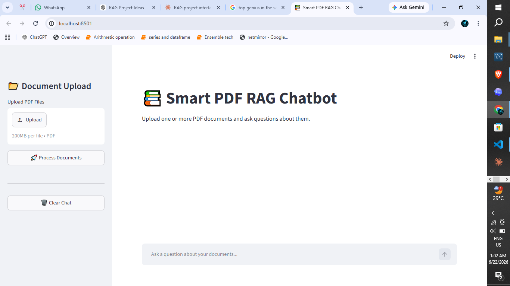
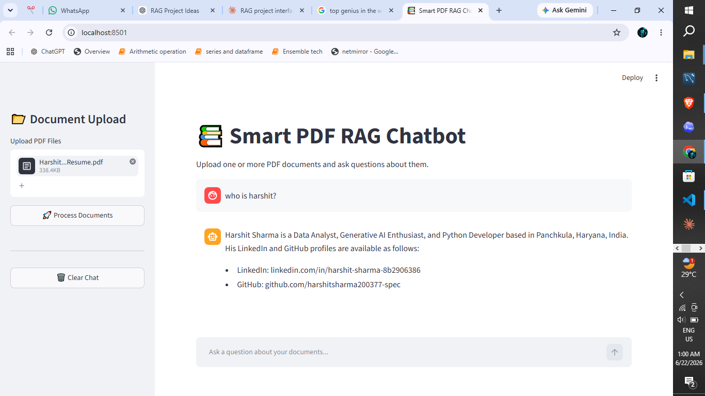

# 📚 Multi-PDF_RAG_Chatbot

A powerful **Retrieval-Augmented Generation (RAG)** chatbot that lets you upload any PDF and ask questions about it — powered by **Groq (LLaMA 3)** and **HuggingFace Embeddings**.

---
## Live demo : https://smart-pdf-rag-chatbot-xwsz2jpturhhkrfyh2afbk.streamlit.app/

---

## 🖥️ Screenshots

### 1. Home Page


### 2. Asking Questions About a PDF


### 3. Detailed Answers from PDF


### 4. Multiple Pdf : Asking Questions About Multiple pdf.  


---

## 🧠 What is RAG?

**RAG (Retrieval-Augmented Generation)** is an AI technique where:

1. Your PDF is broken into small chunks
2. Each chunk is converted into numbers (embeddings)
3. When you ask a question, the most relevant chunks are found
4. An AI model reads those chunks and gives you an accurate answer

Think of it like giving an AI a book to read, then asking it questions about it!

---

## 🗂️ Project Structure

```
📁 Smart-PDF-RAG-Chatbot/
│
├── 📁 data/                  → Put your PDF files here
├── 📁 chroma_db/             → Vector database (auto-created)
├── 📁 screenshots/           → App screenshots
│
├── 📁 utils/                 → All the backend logic
│   ├── loader.py             → Reads PDF files
│   ├── splitter.py           → Splits PDFs into small chunks
│   ├── embeddings.py         → Converts text to numbers (vectors)
│   ├── vectorstore.py        → Saves/loads vectors in ChromaDB
│   └── rag_chain.py          → Connects everything + Groq AI
│
├── app.py                    → Main Streamlit UI
├── .env                      → Your secret API keys
├── requirements.txt          → All Python packages needed
└── README.md                 → This file!
```

---

## ⚙️ How Each File Works

| File | What it does |
|------|-------------|
| `loader.py` | Reads all PDFs from the `data/` folder |
| `splitter.py` | Cuts PDF text into 1000-character chunks |
| `embeddings.py` | Uses HuggingFace `all-MiniLM-L6-v2` to convert text to vectors |
| `vectorstore.py` | Saves vectors in ChromaDB for fast searching |
| `rag_chain.py` | Searches relevant chunks + sends to Groq LLaMA 3 for answer |
| `app.py` | Streamlit web app — the UI you interact with |

---

## 🚀 Getting Started (Step by Step)

### Step 1 — Clone the Repository
```bash
git clone https://github.com/YOUR_USERNAME/Smart-PDF-RAG-Chatbot.git
cd Smart-PDF-RAG-Chatbot
```

### Step 2 — Create a Virtual Environment
```bash
python -m venv venv
```

Activate it:
- **Windows:** `venv\Scripts\activate`
- **Mac/Linux:** `source venv/bin/activate`

### Step 3 — Install Dependencies
```bash
pip install -r requirements.txt
```

### Step 4 — Set Up API Keys

Create a `.env` file in the root folder:
```
GROQ_API_KEY=your_groq_api_key_here
HUGGINGFACEHUB_API_TOKEN=your_huggingface_token_here
```

Get your free keys here:
- 🔑 Groq API Key → https://console.groq.com
- 🔑 HuggingFace Token → https://huggingface.co/settings/tokens

### Step 5 — Run the App
```bash
streamlit run app.py
```

### Step 6 — Use the App
1. Open `http://localhost:8501` in your browser
2. Upload one or more PDF files from the sidebar
3. Click **"🚀 Process Documents"**
4. Wait for processing to complete
5. Ask any question about your PDF in the chat box!

---

## 🛠️ Tech Stack

| Technology | Purpose |
|-----------|---------|
| 🐍 Python | Core programming language |
| 🎈 Streamlit | Web UI framework |
| 🦜 LangChain | RAG pipeline framework |
| 🤗 HuggingFace | Text embeddings (`all-MiniLM-L6-v2`) |
| ⚡ Groq | Super fast LLaMA 3 inference |
| 🗄️ ChromaDB | Vector database for storing embeddings |
| 📄 PyPDF | PDF reading and parsing |

---

## 📦 Requirements

```
streamlit
langchain
langchain-groq
langchain-community
langchain-huggingface
langchain-text-splitters
langchain-chroma
sentence-transformers
chromadb
pypdf
python-dotenv
groq
```

Install all at once:
```bash
pip install -r requirements.txt
```

---

## 💡 How to Use — Example

1. Upload your **Resume.pdf**
2. Ask: *"What are my skills?"*
3. The chatbot reads your resume and answers instantly!

You can upload **any PDF** — books, research papers, resumes, manuals, etc.

---

## 🔮 Future Improvements

- [ ] Support for multiple file types (DOCX, TXT)
- [ ] Chat history memory
- [ ] Source page references in answers
- [ ] Deploy on Streamlit Cloud

---

## 👨‍💻 Author

**Harshit Sharma**
Data Analyst | Generative AI Enthusiast | Python Developer

- 🔗 LinkedIn: [linkedin.com/in/harshit-sharma-8b2906386](https://linkedin.com/in/harshit-sharma-8b2906386)
- 🐙 GitHub: [github.com/harshitsharma200377-spec](https://github.com/harshitsharma200377-spec)

---

## ⭐ If you found this helpful, please give it a star!
